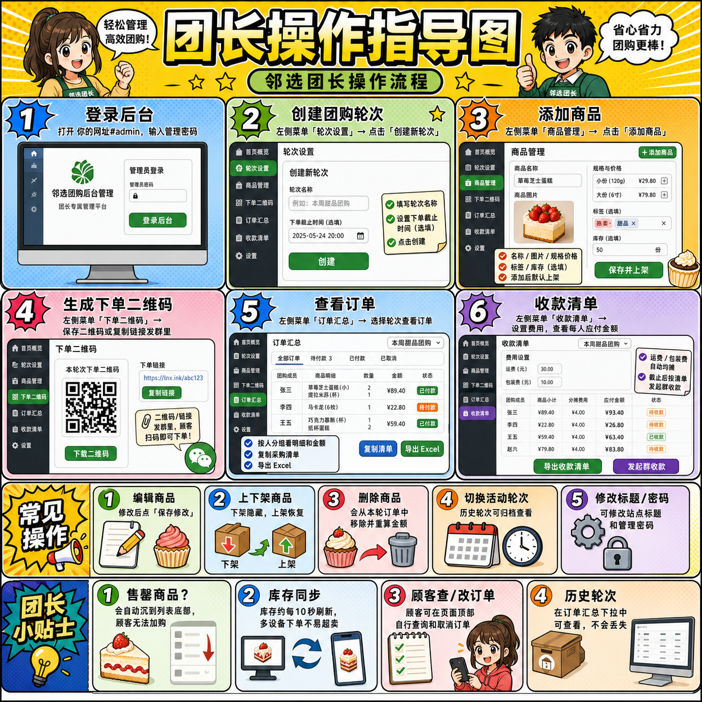

# 邻选 — 社区团购极简下单工具

专为小区团长打造的微信扫码下单工具。设置商品、生成二维码、发到群里——邻居扫码即下单，订单自动汇总，收款金额一键可算。

**无需服务器、无需 App、无需注册、免费使用。**

---

## 给邻居（扫码下单）

1. 在微信群里**长按二维码** → 识别图中二维码
2. 看到商品列表，可**搜索**或**按标签筛选**，**点击选择规格和数量**
3. 选好后点底部**「去下单」**
4. 填写**你的群昵称**（必填）+ 备注（选填，如"不要葱"）
5. 点**「提交订单」**，完成

**如需修改订单**：点页面顶部「查/改订单」，输入你的昵称查询，可以看到所有历史订单（含所属轮次和状态），截止前可自行取消。


---

## 给团长（后台管理）

### 首次部署（15 分钟一次性操作）

1. 注册 [Supabase](https://supabase.com) 免费账号，创建项目
2. 在 Supabase SQL Editor 执行 `supabase-schema.sql`
3. 复制 Supabase 的 Project URL 和 Anon Key
4. 在 [GitHub](https://github.com) 创建仓库，上传所有 HTML 文件
5. 在仓库 Settings → Pages 启用 GitHub Pages
6. 打开部署好的网址，选择小区预设或手动填入 URL/Key
7. 网址后加 `#admin`，设置管理密码

详细步骤见 [setup-guide.html](setup-guide.html)。

### 每次团购操作流程



| 步骤 | 操作 | 位置 |
|------|------|------|
| 1 | 创建团购轮次，设置截止时间 | 后台 → 轮次设置 → 创建新轮次 |
| 2 | 添加本次团购商品（支持整装拆分） | 后台 → 商品管理 → 添加商品 |
| 3 | 开团 + 生成下单二维码发到群里 | 后台 → 轮次设置 → 开团；后台 → 下单二维码 |
| 4 | 实时查看订单，需要时砍单 | 后台 → 订单汇总（自动按人分组） |
| 5 | 截止后复制采购清单、导出 Excel | 后台 → 订单汇总 → 复制/导出 |
| 6 | 设置费用、复制收款清单发起群收款 | 后台 → 收款清单 → 一键复制 |

### 忘记管理密码

在 Supabase → SQL Editor 执行：
```sql
UPDATE settings SET value = '' WHERE key = 'admin_password';
```
然后重新打开 `#admin` 设置新密码。

---

## 主要功能

| 功能 | 说明 |
|------|------|
| 多轮次并行团购 | 允许多个轮次同时进行，不同轮次商品和订单完全隔离 |
| 轮次状态管理 | 策划中 → 进行中 → 已截止/已停止，完整生命周期 |
| 整装拆分 | 山姆/开市客大包装商品自动计算份数和单价 |
| 砍单 + 原因备注 | 团长砍单可填写原因，顾客端红色卡片显示 |
| 采购清单 + Excel 导出 | 按商品汇总采购量，一键复制或导出双 sheet 表格 |
| 费用均摊 | 运费/包装费等按人数自动均摊到分 |
| 商品导入导出 | 轮次间复用商品配置，Excel 导入导出 |
| 首次使用小区预设 | 首次打开可选预设小区，无需手动填 URL/Key |
| 库存轮询 | 每 10 秒自动刷新库存，多人同时下单不超卖 |
| 5 秒幂等保护 | 防止重复提交，跨轮次不误杀 |

---

## 文件说明

| 文件 | 用途 |
|------|------|
| `order.html` | 核心工具，包含团长后台 + 顾客下单端（单文件） |
| `landing.html` | 项目宣传页面，可分享给其他团长 |
| `setup-guide.html` | 图文部署教程（Supabase + GitHub Pages） |
| `admin-guide.html` | 团长操作手册（日常团购全流程） |
| `customer-guide.html` | 邻居下单指南（扫码 → 下单 → 查单） |
| `supabase-schema.sql` | 数据库初始化脚本（表 + RLS + RPC） |
| `FULL-TEST-CHECKLIST.md` | 全量功能测试清单（109 条用例） |
| `README.md` | 本文件 |

---

## 技术说明

- 前端：单文件 HTML，零构建，打开即用
- 数据库：Supabase（免费层，500MB 存储 / 月）
- 托管：GitHub Pages（免费，全球 CDN）
- 安全：管理密码 SHA-256 哈希存储，RLS 数据隔离，SECURITY DEFINER 函数权限控制
